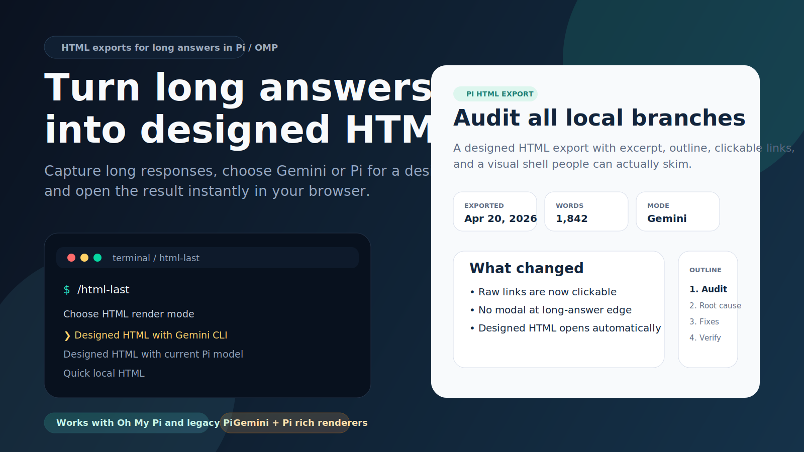
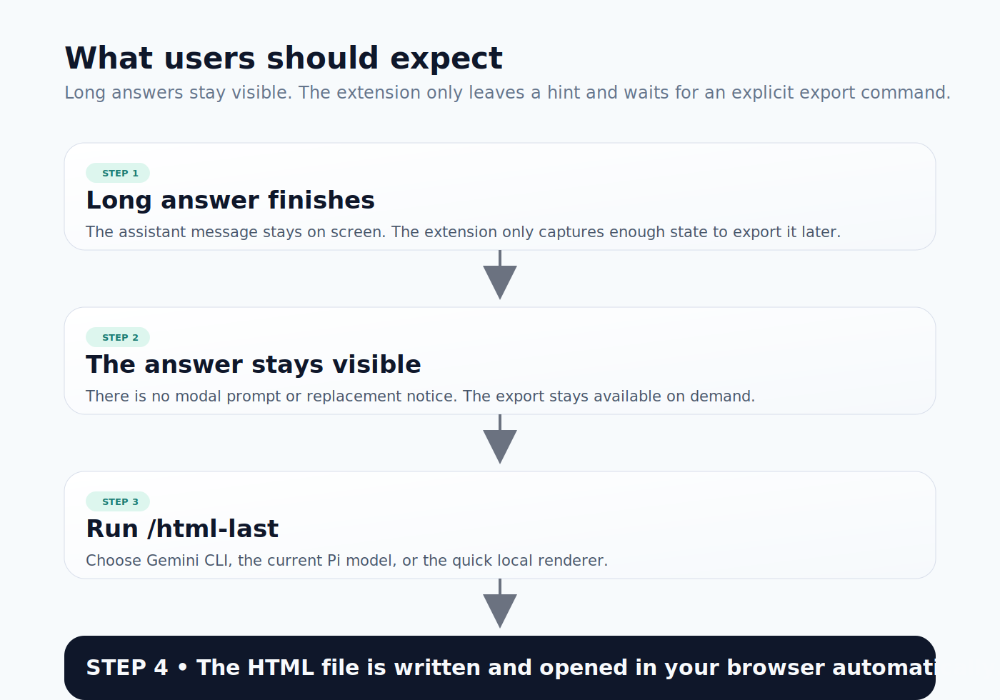
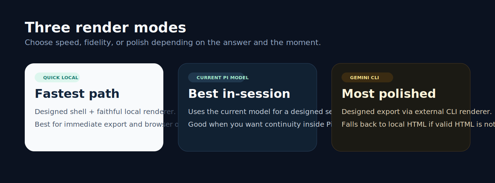

# html-long-answer

Make long assistant answers exportable as designed HTML in both Oh My Pi / OMP and legacy Pi.

<p>
  
</p>

## Why this exists

Long answers are useful, but they are not always pleasant to read inside the terminal. This extension captures long assistant replies, keeps them available for later export, and lets you turn them into browser-opened HTML in one step.

It is built for two workflows:
- fast local HTML when you just want a readable artifact now
- richer designed HTML when you want a second-pass render via the current Pi model or Gemini CLI

## What users should look for

<p>
  
</p>

The extension does **not** interrupt the end of a long answer anymore.

Instead it:
1. captures the answer into session state
2. shows a lightweight notice that HTML export is available
3. waits for the user to run `/html-last`
4. writes and opens the HTML artifact in the default browser

## Render modes

<p>
  
</p>

| Mode | What it does | Best for |
|---|---|---|
| `local` | Fast local render with a designed shell, outline rail, excerpt hero, and clickable links | Speed and reliability |
| `pi` | Uses the current Pi model for a richer second-pass HTML render | Staying in the current session/model context |
| `gemini` | Uses Gemini CLI for a richer external render; falls back to local HTML if valid HTML is not returned | Maximum polish when Gemini is available |

## Commands

| Command | Result |
|---|---|
| `/html-last` | Opens quick local HTML without starting a Pi model turn |
| `/html-last choose` | Opens a render-mode chooser |
| `/html-last local` | Forces quick local HTML |
| `/html-last pi` | Forces designed HTML via the current Pi model |
| `/html-last gemini` | Forces designed HTML via Gemini CLI |
| `/html-last-version` | Shows the loaded extension version |

## Quick start

Native Pi npm install:

```bash
pi install npm:pi-html-long-answer-extension
```

Native Pi git install:

```bash
pi install git:https://github.com/zakelfassi/pi-html-long-answer-extension.git
```

Oh My Pi / OMP global install:

```bash
mkdir -p ~/.omp/agent/extensions
git clone https://github.com/zakelfassi/pi-html-long-answer-extension.git \
  ~/.omp/agent/extensions/html-long-answer
```

Then ask for a long answer and run:

```text
/html-last-version
/html-last local
```

## Installation and compatibility matrix

This package is published to npm for Pi package discovery and remains installable directly from git for pinned or source-reviewed installs.

| Harness / platform | Install or load path | Verify after install | Expected result | Status |
|---|---|---|---|---|
| Native Pi npm package | `pi install npm:pi-html-long-answer-extension` | Run `/html-last-version`, then `/html-last local` after a long answer | Version notification, then a browser-opened local HTML export | Supported package path; appears in npm-backed Pi package discovery |
| Native / legacy Pi git | `pi install git:https://github.com/zakelfassi/pi-html-long-answer-extension.git` | Run `/html-last-version`, then `/html-last local` after a long answer | Version notification, then a browser-opened local HTML export | Supported source install path; verify on your installed Pi version |
| Manual Pi extension root | Clone to `~/.pi/agent/extensions/html-long-answer` | Restart/load Pi, then run `/html-last-version` and `/html-last local` | Extension auto-loads from the global root | Supported path; verify on your installed Pi version |
| Oh My Pi / OMP | Clone to `~/.omp/agent/extensions/html-long-answer` | Restart/load OMP, then run `/html-last-version` and `/html-last local` | Extension auto-loads from the OMP global root | Supported path; verify on your installed OMP version |
| OMP one-off test | `omp -e /absolute/path/to/index.js` | Run `/html-last-version` | Version notification appears | Supported one-off smoke path |
| Pi-compatible derived harnesses | Use the Pi npm/git/manual instructions if the harness honors Pi `package.json.pi.extensions` or Pi extension roots | Run `/html-last-version` and `/html-last local` | Same command behavior as Pi | Harness-specific commands are unverified |
| LazyPi | No LazyPi-specific command is documented here | Use the Pi-compatible row only if your LazyPi setup exposes Pi-compatible extension loading | Do not assume a LazyPi-only install command | Exact LazyPi third-party extension flow unverified |
| Gemini CLI | Optional external renderer used by `/html-last gemini` | Run `/html-last gemini` after a long answer | Designed HTML export, or a clean fallback to local HTML if Gemini is unavailable/invalid | Optional |

## Verify after install

| Command | Expected result |
|---|---|
| `/html-last-version` | Shows the loaded `html-long-answer` version |
| `/html-last` | Writes a local HTML artifact and opens it in the default browser without starting a Pi model turn |
| `/html-last choose` | Opens the render-mode chooser when UI selection is available |
| `/html-last local` | Writes a local HTML artifact and opens it in the default browser |
| `/html-last pi` | Queues a current-model designed HTML pass, then writes the result or falls back safely |
| `/html-last gemini` | Uses Gemini CLI when available; invalid/unsafe/non-HTML output falls back to local HTML |

For reproducible installs, pin an npm version or a git ref/tag once you choose a release:

```bash
pi install npm:pi-html-long-answer-extension@0.2.0
pi install git:https://github.com/zakelfassi/pi-html-long-answer-extension.git@v0.2.0
```

## Runtime behavior

- Long answers are detected from message length / line / paragraph thresholds.
- Long answers are captured into session state so `/html-last` can work on prior assistant replies.
- Local and designed exports open automatically in the browser after the file is written.
- Raw URLs such as `https://example.com` are linkified in local exports.
- Rich Pi/Gemini renders must be standalone HTML documents with inline CSS only.
- Rich HTML is validated before writing: scripts, event-handler attributes, `javascript:` URLs, external assets, external CSS URLs, unsafe tags, oversized output, and overly complex output are rejected or routed to fallback behavior.
- Invalid, unsafe, or non-HTML rich output falls back to the local renderer instead of writing a malformed nested document.

## Repo layout

```text
html-long-answer/
├── .github/
│   └── workflows/
│       └── ci.yml
├── assets/
│   ├── flow.svg
│   ├── hero.svg
│   └── render-modes.svg
├── test/
│   └── extension.test.js
├── index.js
├── package.json
├── pnpm-lock.yaml
├── README.md
└── .gitignore
```

## Development notes

The extension runtime still lives in a single file (`index.js`) so it is easy to install directly into a Pi or OMP extension root. Tests and CI live outside the runtime path.

Use PNPM:

```bash
pnpm install
pnpm test
```

If you modify it, re-test these flows:
- long answer -> lightweight notice only
- `/html-last` -> local HTML writes and opens without starting a Pi model turn
- `/html-last choose` -> chooser appears
- `/html-last local` -> HTML writes and opens
- `/html-last pi` -> second-pass render path queues/runs and validates rich HTML
- `/html-last gemini` -> Gemini render path succeeds or cleanly falls back
- `/html-last-version` -> version shown in-session

## Trust and security

Extensions run with your user permissions. Only install from sources you trust, review the source before installing, and pin a git ref or tag when you need reproducible behavior.

Rich HTML generated by Pi or Gemini is treated as untrusted until it passes this extension's validation. The validator is intentionally conservative: if rich output includes active scripts, event handlers, external assets, or unsafe URLs, the extension falls back to local HTML rather than writing the rich document.
